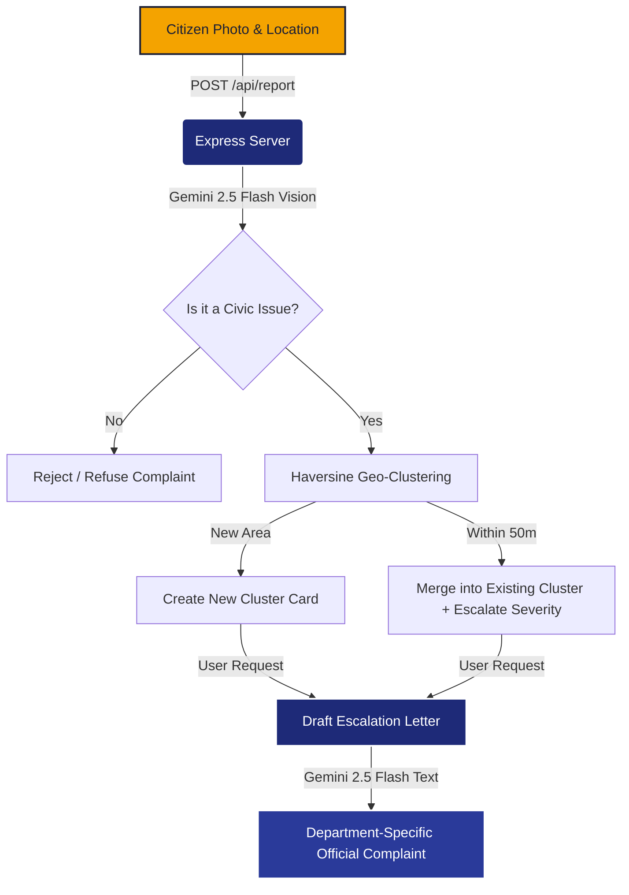

# 🏙️ Community Hero
> **Spot it. Snap it. The agent handles the rest.** A premium, hyperlocal civic infrastructure reporting and resolution platform powered by Google Gemini and Google Maps.

[](https://aistudio.google.com/)
[](https://cloud.google.com/run)
[](https://opensource.org/licenses/MIT)

---

## 💡 The Vision

Traditional civic platforms are **passive feedback forms**. They burden citizens with selecting jurisdictions, describing issues, and drafting formal complaints. Worse, they flood municipal departments with dozens of duplicate reports for the same pothole or streetlight.

**Community Hero** is an **active agentic system** that shifts the burden from the citizen to the AI agent:
1. **Report in 2 Taps**: Take a photo, hit submit.
2. **AI Inspection**: Gemini classifies the issue type, evaluates severity, and checks if it's a real public hazard (automatically rejecting non-civic/private issues).
3. **Smart Clustering**: Merges duplicate reports within 50 meters into a single weighted issue, amplifying community urgency.
4. **Automated Escalation**: Drafts a formal, department-addressed municipal complaint using community-weight data (e.g., *"23 residents have reported this..."*).

---

## 🛠️ System Architecture



---

## ✨ Features

### 1. Zero-Friction Camera Capture
- Integrated with browser camera systems (`input capture="environment"`) to open the rear camera on mobile.
- Extracts real-time latitude/longitude coordinates directly from mobile GPS for automated pin placement.

### 2. Gemini-Powered Vision Analysis
- Processes base64 image data using the **Gemini 2.5 Flash** model.
- Uses strict JSON schema enforcement (`responseSchema`) to parse:
  - **Issue Type** (Pothole, Streetlight, Water Leakage, Garbage, Damaged Sidewalk)
  - **Severity** (Low, Medium, High, Critical)
  - **Description** (One short factual sentence describing only what is visible)
  - **Validation Flag** (Rejects photos of laptops, personal items, or indoor objects)

### 3. Geospatial Haversine Clustering
- Uses the **Haversine Formula** to determine the precise distance between reports.
- If a new report matches an existing report type and falls within **50 meters** of its coordinates, it is automatically merged.
- Duplicate reports increase the "citizen report count" and escalate severity to the highest level reported by the community.

### 4. Jurisdiction-Aware Official Drafting
- Maps civic issues to the correct municipal division (e.g., *Roads & Infrastructure*, *Solid Waste Management*, *Water Supply & Sewerage*).
- Drafts a professional, formal complaint letter addressing the division head, dynamically referencing the community support count to convey urgency.

---

## 📦 Project Structure

```
├── client/                 # React (Vite) Frontend App
│   ├── src/
│   │   ├── App.jsx         # Primary application dashboard & state
│   │   ├── styles.css      # Custom "Civic-Modern" UI design system
│   │   └── main.jsx
│   ├── index.html          # Web entrypoint & Google Fonts setup
│   └── vite.config.js
├── server/                 # Express API Backend
│   └── index.js            # Server app, Gemini routes, and static file hosting
├── Dockerfile              # Unified build config (Vite Client + Express Server)
├── .gcloudignore           # Cloud Build exclusion overrides
├── .dockerignore           # Local Docker context exclusions
└── DEPLOY.md               # Detailed Cloud Run deployment guide
```

---

## 💻 Tech Stack Rationale

| Layer | Technology | Rationale |
| :--- | :--- | :--- |
| **Frontend** | React (Vite) | Instant hot reloading, super small bundle footprint, and efficient rendering. |
| **Backend** | Node.js + Express | Lightweight, single-thread event loop suitable for streaming uploads and asynchronous model requests. |
| **Styling** | Vanilla CSS3 | Custom variables and custom layout architecture to match design tokens without Tailwind bloat. |
| **AI Model** | Gemini 2.5 Flash | High speed, reliable structured JSON output capability, and state-of-the-art vision reasoning. |
| **Database** | In-Memory (Phase 1) | Ultra-fast local testing; prepared for clean Firestore swap in final production. |
| **Deployment**| Google Cloud Run | Serverless scaling, automatic HTTPS (required for camera/GPS APIs), and simple source-to-service deployments. |

---

## 🚦 Getting Started

### Prerequisites
- Node.js (version 20 or higher)
- A Google Gemini API Key (from [Google AI Studio](https://aistudio.google.com/))
- A Google Maps JavaScript API Key (from [Google Cloud Console](https://console.cloud.google.com/))

### 1. Environment Setup
Create a `.env` file in the `client/` subdirectory:
```bash
# client/.env
VITE_MAPS_KEY=your_google_maps_javascript_api_key
```

### 2. Local Run
To run both the backend Express API and the frontend Vite server concurrently with dev proxies:

```bash
# Install dependencies for both projects
npm run install:all

# Run Express Backend (Terminal 1)
cd server
GEMINI_API_KEY=your_gemini_api_key npm start

# Run Vite Frontend (Terminal 2)
cd client
npm run dev
```

The React frontend will launch at `http://localhost:5173`, proxying `/api/*` requests to the Express backend on `http://localhost:8080`.

---

## 🚀 Deployed Production Build

The production build runs inside a unified Docker container. Express serves both the REST API endpoints and the precompiled static React frontend from `client/dist`.

### Dockerized Build (Local Test)
To build and run the combined Docker container locally:
```bash
docker build -t community-hero .
docker run -p 8080:8080 -e GEMINI_API_KEY="your_gemini_key" community-hero
```

### Cloud Run Deployment
Deploy from the project root using Google Cloud SDK:
```bash
gcloud run deploy community-hero \
  --source . \
  --region asia-south1 \
  --allow-unauthenticated \
  --update-env-vars GEMINI_API_KEY=your_gemini_api_key \
  --clear-base-image
```
*Note: The `--clear-base-image` flag ensures that Cloud Run builds directly from the root `Dockerfile` instead of relying on buildpacks.*

---

## 📡 API Specification

### `GET /api/reports`
Returns all registered reports in reverse chronological order (newest first).
* **Response**: `200 OK` (Array of report objects)

### `POST /api/report`
Uploads a new report. Classifies the photo, parses location, and attempts to cluster nearby.
* **Body**:
  ```json
  {
    "photo": "data:image/jpeg;base64,...",
    "lat": 12.9716,
    "lng": 77.5946
  }
  ```
* **Response**: `200 OK` (Report object with `merged: true/false` key)

### `POST /api/report/:id/complaint`
Requests the AI agent to compile a formal grievance letter to the responsible municipal department.
* **Response**: `200 OK` (Updated report object with a `complaint` field containing plain-text letter)
* **Error**: `422 Unprocessable Entity` (If the report was classified as a non-civic/private issue)

---

## 🛡️ License
Distributed under the MIT License. See [LICENSE](LICENSE) for more information.
