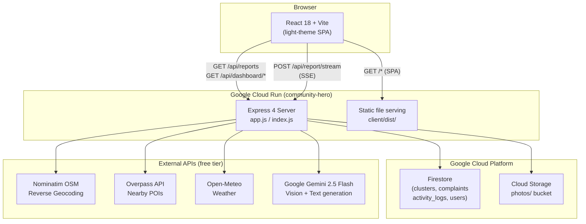
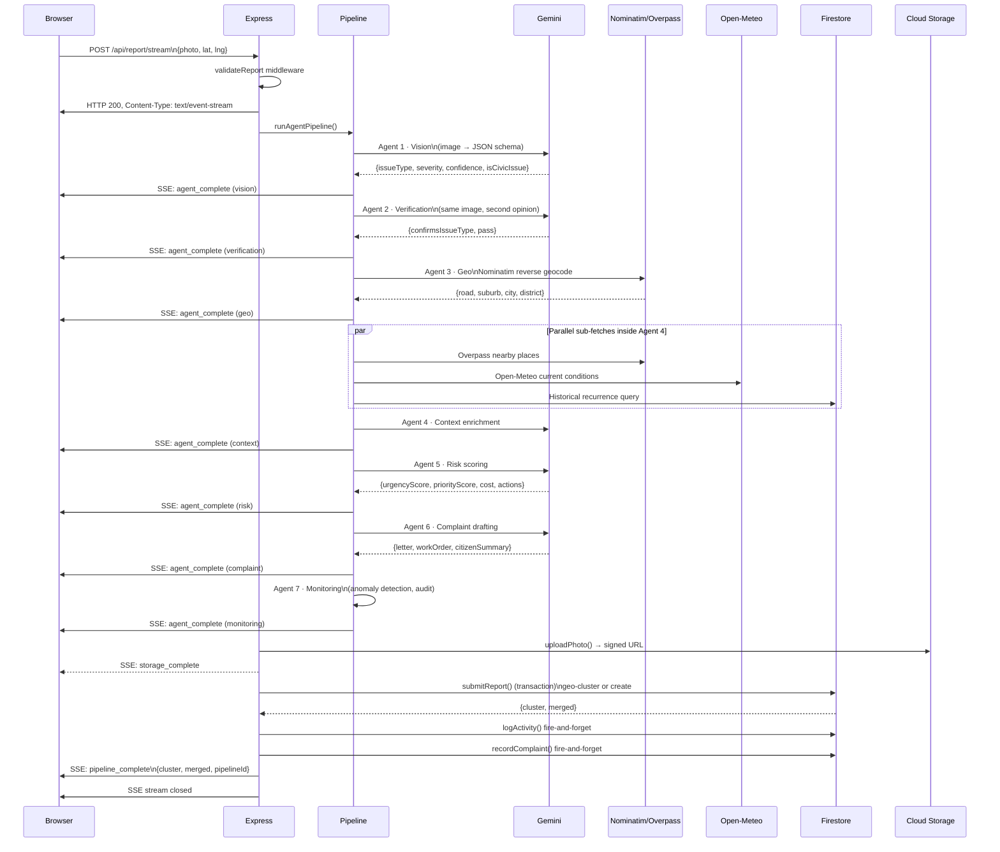

# Architecture

## System Overview

Community Hero is a **single-container** application deployed on Google Cloud Run. One Docker image contains both the Express API server and the pre-built React frontend. There is no separate frontend hosting service.



---

## Request Lifecycle — Photo Submission (SSE path)



---

## Module Dependency Graph

```
index.js
  └── app.js
        ├── routes/api.js
        │     ├── controllers/reportController.js
        │     │     ├── agents/pipeline.js
        │     │     │     ├── agents/vision.js     → config (Gemini)
        │     │     │     ├── agents/verification.js → config (Gemini)
        │     │     │     ├── agents/geo.js         → fetch (Nominatim)
        │     │     │     ├── agents/context.js     → fetch (Overpass, Open-Meteo)
        │     │     │     │                         → store/clusters.js (history)
        │     │     │     ├── agents/risk.js        → config (Gemini)
        │     │     │     ├── agents/complaint.js   → config (Gemini)
        │     │     │     └── agents/monitoring.js  → store/activity_logs.js
        │     │     ├── services/storage.js → config (GCS bucket)
        │     │     └── store/clusters.js   → config (Firestore)
        │     ├── controllers/streamController.js   (same deps as report)
        │     ├── controllers/complaintController.js → agents/complaint.js
        │     ├── controllers/dashboardController.js
        │     │     ├── store/clusters.js
        │     │     └── services/dashboardStats.js
        │     └── controllers/demoController.js → store/clusters.js
        ├── middleware/errorHandler.js
        └── middleware/rateLimiter.js
```

---

## Data Model

### Firestore Collection: `clusters`

The primary document. One cluster = one distinct civic issue at a location. Multiple citizen reports of the same issue at the same spot are merged into the same cluster document.

```typescript
interface Cluster {
  // Classification
  issueType: "Pothole" | "Streetlight" | "Water Leakage" | "Garbage" | "Damaged Sidewalk" | "Other";
  severity: "Low" | "Medium" | "High" | "Critical";
  description: string;
  confidence: number; // 0–100, from Gemini
  isCivicIssue: boolean;
  rawObservations: string[]; // from Vision Agent
  affectedInfrastructure: string | null;

  // Location
  lat: number | null;
  lng: number | null;

  // Lifecycle
  status: "Reported" | "Complaint Drafted" | "In Progress" | "Resolved";
  reportCount: number; // incremented on each merge
  statusHistory: Array<{
    status: string;
    at: string; // ISO timestamp
    note: string;
  }>;

  // Media
  photo: string; // primary photo URL (or base64 in dev)
  photos: string[]; // all photo URLs

  // Complaint
  complaint: string | null; // formal letter text
  complaintSubject: string | null;
  department: string | null; // recipient department
  workOrder: object | null; // structured work order from Agent 6
  citizenSummary: string | null; // plain-language summary for citizens
  followUpDate: string | null; // ISO timestamp

  // Enriched agent outputs (stored as sub-objects)
  geoContext: GeoResult | null;
  contextResult: ContextResult | null;
  riskAssessment: RiskResult | null;
  pipelineTrace: MonitoringResult | null;

  // Timestamps
  createdAt: Timestamp;
  updatedAt: Timestamp | null;
}
```

### Firestore Collection: `complaints`

Lightweight log of all complaint texts filed. Used for audit and deduplication.

### Firestore Collection: `activity_logs`

Immutable append-only audit trail for every pipeline run, merge event, and complaint generation.

---

## Geo-Clustering Algorithm

1. **Bounding-box pre-filter** (Firestore): Query clusters with the same `issueType` and `isCivicIssue=true` within a ±0.001° lat box (~111 m). This uses the composite Firestore index.
2. **Haversine precise check** (in-memory): For each candidate from step 1, compute the exact distance in metres. If any candidate is within `CLUSTER_RADIUS_M` (50 m), it is a match.
3. **Transactional merge or create**: Firestore `runTransaction()` ensures read-before-write atomicity. Two simultaneous submissions for the same location cannot each create a new cluster.

On merge:

- `reportCount` is incremented
- `severity` is escalated to the worse of the two
- `photos` array is extended
- Agent enrichment (context, risk, complaint) is upgraded to the latest pipeline output

---

## Security Model

| Layer            | Control                                                                                                            |
| ---------------- | ------------------------------------------------------------------------------------------------------------------ |
| HTTPS            | Cloud Run enforces TLS; HTTP redirects to HTTPS                                                                    |
| Headers          | `helmet` sets `X-Content-Type-Options`, `X-Frame-Options`, `Referrer-Policy`, etc.                                 |
| CORS             | Disabled in production (`origin: false`); permissive only in development                                           |
| Rate limiting    | Pipeline: 5 req/min per IP; API: 120 req/min per IP                                                                |
| Input validation | `validateReport` middleware rejects malformed photos, invalid coordinates, oversized payloads (>12 MB)             |
| Secrets          | `GEMINI_API_KEY` injected at Cloud Run runtime; never in image or client bundle                                    |
| Storage          | Public Access Prevention enforced at org level; all photos require signed URLs                                     |
| IAM              | Cloud Run SA has minimum required roles: `storage.objectAdmin`, `iam.serviceAccountTokenCreator`, `datastore.user` |

---

## Scalability Notes

- **Stateless server**: All state is in Firestore and GCS. Cloud Run can scale to any number of replicas.
- **Dashboard insights cache**: Per-instance in-memory, 5-minute TTL. On multi-replica deployments, each instance may generate its own Gemini call on cold start. Replace with Cloud Memorystore (Redis) for a shared cache at scale.
- **SSE connections**: Cloud Run has a 60-minute request timeout. The typical pipeline completes in 15–40 seconds. No keep-alive extension is needed.
- **Firestore read limits**: `listAllClusters()` (used by the dashboard) reads up to 500 documents per call. For production deployments with thousands of reports, add pagination or time-range filtering to the dashboard query.
